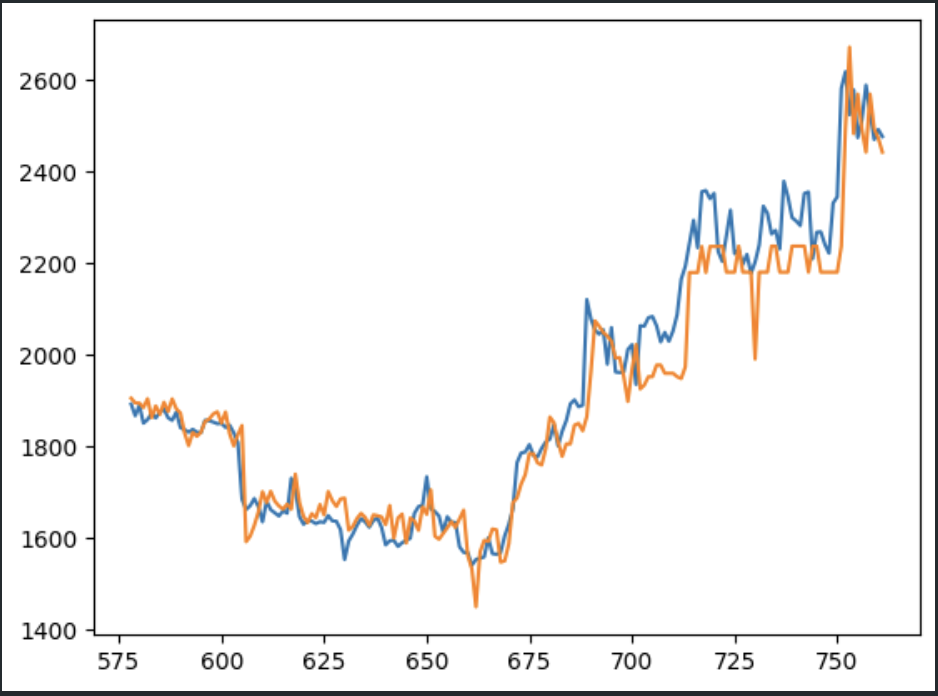

[![Contributors][contributors-shield]][contributors-url]
[![Forks][forks-shield]][forks-url]
[![Stargazers][stars-shield]][stars-url]
[![Issues][issues-shield]][issues-url]
[![MIT License][license-shield]][license-url]

<!-- PROJECT LOGO -->
<br />
<div align="center">
  <a href="https://github.com/LFGHO/gho">
    
  </a>

<h3 align="center">GHOvardhan</h3>

  <p align="center">
    "GHOvardhan: Unleashing Digital Prosperity, Inspired by Tradition"
    <br />
    <a href="DEMO_LINK">View Demo</a>
    ·
    <a href="https://github.com/LFGHO/gho/issues">Report Bug</a>
    ·
    <a href="https://github.com/LFGHO/gho/issues">Request Feature</a>
  </p>
</div>


<!-- ABOUT THE PROJECT -->
## About The Project

<!--  -->


In the heart of India's vibrant cultural tapestry lies the Govardhan festival, a symbol of abundance and divine blessings. Inspired by this auspicious legacy, our venture "GHOvardhan" emerges as a modern-day harbinger of prosperity. Just as Vardhan signifies increasing wealth and auspiciousness, GHOvardhan stands as a sanctuary of financial growth and security in the digital realm. Our company is not merely a platform; it's a guardian of your aspirations, a custodian of your digital wealth. With a suite of meticulously crafted vaults, we ensure your GHO investments flourish, echoing the very essence of Vardhan - growth and prosperity. Our services transcend mere transactions; they're a seamless fusion of tradition and innovation, designed to cater to every GHO-related need, from investing to transferring, from payments to safeguarding your digital treasures. Embrace GHOvardhan, where each interaction is not just a transaction but a step towards a future replete with blessings and prosperity, much like the auspicious Govardhan itself.


## Features

<ol>
  <!-- <li>
    <a href="#getting-started">Getting Started</a>
    <ul>
      <li><a href="#prerequisites">Prerequisites</a></li>
      <li><a href="#installation">Installation</a></li>
    </ul>
  </li> -->
  <li><a href="# Credit Delegation">Credit Delegation</a></li>
  <li><a href="# ERC4626 Vaults powered by our in-house ML models">MultiStrategy ML-based Vaults</a></li>
  <li><a href="# Full fledged Account Abstraction">Account Abstraction</a></li>
  <li><a href="## Interactive UI">Interactive User Interface</a></li>
  <li><a href="#license">License</a></li>
  <li><a href="#license">License</a></li>
  <li><a href="#contributing">Contributing</a></li>
</ol>

<br>
<br>
<br>
<p align="right">(<a href="#readme-top">back to top</a>)</p>

# ERC4626 Vaults powered by our in-house ML models
<p align="center">

</p>

The diagram above showcases the **predictive performance** of our **ML model** over a **six-month period**, ranging from **July 2023 to January 2024**, for price of ETH on the mainnet. 
The blue line represents the actual price of ETH as recorded over the timeframe, serving as the ground truth against which we evaluate our model's accuracy. 
In contrast, the orange line illustrates the predicted prices as generated by our ML model through a simulation. 

The model has been trained on historical data, incorporating various features such as market trends, trading volumes, and global economic indicators, to forecast future price movements of ETH. Our model utilizes advanced algorithms capable of capturing complex patterns in the data, which is evidenced by the close tracking between the predicted (orange) and actual (blue) values. This not only demonstrates the model's robustness but also its potential utility for investors and traders seeking to navigate the volatile cryptocurrency market with greater foresight.

<br>
<br>

# Credit Delegation

We have also integrated **Credit Delegation**, a key component of the **Aave** protocol, to revolutionize the way lending and borrowing occurs in the DeFi space. Credit Delegation is a novel approach that allows users with deposited assets to delegate their credit lines to others, enabling borrowers to access loans without collateral. This mechanism is not just a financial innovation but a step towards a more inclusive and flexible lending system.

Leveraging this feature, our website offers a unique **social interface** where users can seamlessly interact with the DeFi lending market. 
Borrowers can post credit borrow requests on our platform, making their case to potential lenders. On the other side, users who wish to delegate their credit can easily browse through these requests and, with a simple click, approve and delegate their credits to a borrower. 
This process democratizes the lending process, connecting delegators with potential delegates directly.

Similarly, users looking to lend their credits can post a lending offer. When someone accepts their offer, the lender receives a notification in their personalized dashboard. From there, they can efficiently review and sign the transaction to delegate their credit. This system not only simplifies the borrowing and lending process but also adds a layer of social interaction, fostering a community-driven financial ecosystem. 

Through our platform, we are not just facilitating financial transactions; we are building a community where trust, transparency, and collaboration are at the forefront, revolutionizing how credit is delegated in the digital age

<br>
<br>

# Full fledged Account Abstraction
<p align="center">

</p>

Our project harnesses the innovative capabilities of **ERC4337** standard for **account abstraction**, providing a seamless integration of **smart accounts** with our custom **Bundler and Paymaster Infrastructure**. This setup enables advanced features like **ERC712** and **ERC2612 permits**, allowing for more secure and efficient message and transaction signing processes. By incorporating **OpenZeppelin's relayer** services, we ensure that transactions are relayed efficiently, enhancing the scalability and reliability of our system. 
Furthermore, our platform integrates a unique **social login feature** (Login with email, gmail, twitter, etc.), along with multi-wallet support like **Metamask**, **WalletConnect*, and **Coinbase** empowering users to access their smart accounts using their social credentials. 
This not only simplifies the login process but also provides an option to **effortlessly switch between their social-linked smart accounts and personal EOA accounts**. 
This integration of social logins with smart accounts helps make On-chain ERC20 transactions more accessible and user-friendly, particularly for those new to the Ethereum ecosystem.

See the [open issues](https://github.com/LFGHO/gho/issues) for a full list of proposed features (and known issues).

<p align="right">(<a href="#readme-top">back to top</a>)</p>

<br>
<br>
<br>

# Getting Started

## Using the SDK

For in detail documentation of the SDK, please refer to the [Documentation](./AaveV3SDK/README.md)

To use this SDK, ensure Node.js is installed on your system. Follow these steps to get started:

```bash
$ git  clone https://github.com/LFGHO/gho.git

$ cd gho/AaveV3SDK

$ npm  install
```

For dependency installation, follow these steps:

```bash
$ npm init --yes
$ npm install dotenv viem
$ npm install --save-dev typescript ts-node
$ npx tsc --init
```

## Running the Web App Locally

1. Clone the repo
  ```sh
  git clone https://github.com/LFGHO/gho.git
  ```

2. Go to repo
  ```sh
  cd gho
  ```

3. Configure the environment
  Use the `.env.example` files are reference to add your API keys and config parameters to be able to run the web app locally.

3. Split the Terminal into 2 parts (Cmd + \)
  ```sh
  # 1st Terminal
    $ cd frontend_main
    $ npm install
    $ npm run dev
  
  # 2nd Terminal
    $ cd backend_main
    $ npm install
    $ npm run dev
  ```
  
<p align="right">(<a href="#readme-top">back to top</a>)</p>


### Built With

* **Solidity**
* **Viem.js**
* **Typescript**
* **Vite Tailwind**
* **React.js**
* **Node.js**
* **MongoDB**
* **Ethers.js**

<p align="right">(<a href="#readme-top">back to top</a>)</p>

<!-- CONTRIBUTING -->
## Contributing

Contributions are what make the open source community such an amazing place to learn, inspire, and create. Any contributions you make are **greatly appreciated**.

If you have a suggestion that would make this better, please fork the repo and create a pull request. You can also simply open an issue with the tag "enhancement".
Don't forget to give the project a star! Thanks again!

1. Fork the Project
2. Create your Feature Branch (`git checkout -b feature/AmazingFeature`)
3. Commit your Changes (`git commit -m 'Add some AmazingFeature'`)
4. Push to the Branch (`git push origin feature/AmazingFeature`)
5. Open a Pull Request

<p align="right">(<a href="#readme-top">back to top</a>)</p>

## License

Distributed under the MIT License. See `LICENSE.txt` for more information.

<p align="right">(<a href="#readme-top">back to top</a>)</p>

<!-- MARKDOWN LINKS & IMAGES -->
<!-- https://www.markdownguide.org/basic-syntax/#reference-style-links -->
[contributors-shield]: https://img.shields.io/github/contributors/LFGHO/gho.svg?style=for-the-badge
[contributors-url]: https://github.com/LFGHO/gho/graphs/contributors
[forks-shield]: https://img.shields.io/github/forks/LFGHO/gho.svg?style=for-the-badge
[forks-url]: https://github.com/LFGHO/gho/network/members
[stars-shield]: https://img.shields.io/github/stars/LFGHO/gho.svg?style=for-the-badge
[stars-url]: https://github.com/LFGHO/gho/stargazers
[issues-shield]: https://img.shields.io/github/issues/LFGHO/gho.svg?style=for-the-badge
[issues-url]: https://github.com/LFGHO/gho/issues
[license-shield]: https://img.shields.io/github/license/LFGHO/gho.svg?style=for-the-badge
[license-url]: https://github.com/LFGHO/gho/blob/master/LICENSE.txt
[product-screenshot]: ./Utils/Project_Screenshot.png
