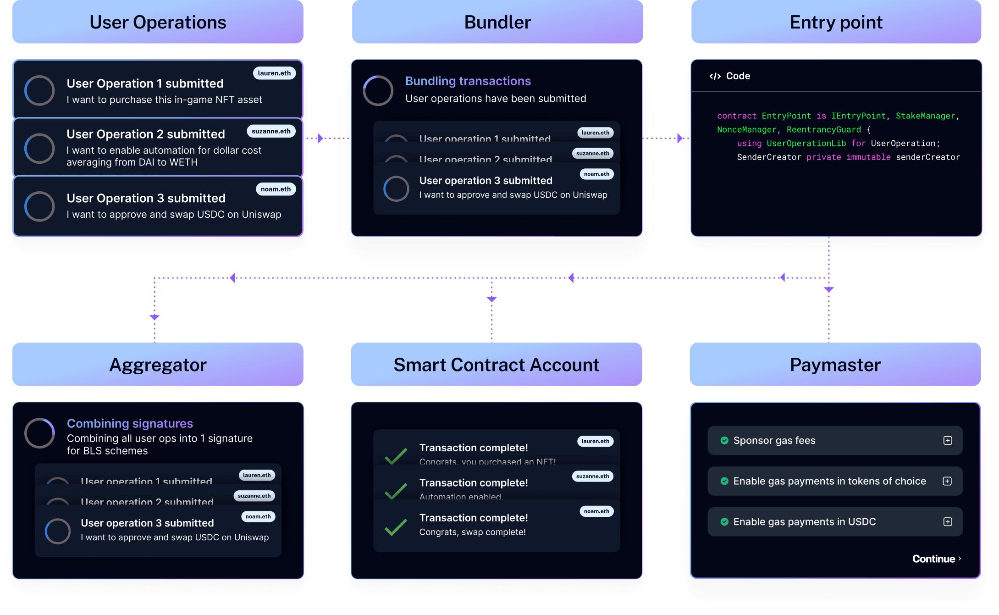

[![Contributors][contributors-shield]][contributors-url]
[![Forks][forks-shield]][forks-url]
[![Stargazers][stars-shield]][stars-url]
[![Issues][issues-shield]][issues-url]
[![MIT License][license-shield]][license-url]

<!-- PROJECT LOGO -->
<br />
<div align="center">
  <a href="https://github.com/LFGHO/gho">
    
  </a>

<h3 align="center">GHOvardhan</h3>

  <p align="center">
    "GHOvardhan: Unleashing Digital Prosperity, Inspired by Tradition"
    <br />
    <a href="DEMO_LINK">View Demo</a>
    ·
    <a href="https://github.com/LFGHO/gho/issues">Report Bug</a>
    ·
    <a href="https://github.com/LFGHO/gho/issues">Request Feature</a>
  </p>
</div>


<!-- ABOUT THE PROJECT -->
## About The Project


In the heart of India's vibrant cultural tapestry lies the Govardhan festival, a symbol of abundance and divine blessings. Inspired by this auspicious legacy, our venture "GHOvardhan" emerges as a modern-day harbinger of prosperity. Just as Vardhan signifies increasing wealth and auspiciousness, GHOvardhan stands as a sanctuary of financial growth and security in the digital realm. Our company is not merely a platform; it's a guardian of your aspirations, a custodian of your digital wealth. With a suite of meticulously crafted vaults, we ensure your GHO investments flourish, echoing the very essence of Vardhan - growth and prosperity. Our services transcend mere transactions; they're a seamless fusion of tradition and innovation, designed to cater to every GHO-related need, from investing to transferring, from payments to safeguarding your digital treasures. Embrace GHOvardhan, where each interaction is not just a transaction but a step towards a future replete with blessings and prosperity, much like the auspicious Govardhan itself.

<p align="right">(<a href="#readme-top">back to top</a>)</p>

## Features

## Full fledged Account Abstraction
<!-- { width=50% } -->


- 

See the [open issues](https://github.com/LFGHO/gho/issues) for a full list of proposed features (and known issues).

<p align="right">(<a href="#readme-top">back to top</a>)</p>


<!-- GETTING STARTED -->
## Getting Started

## Using the SDK

For in detail documentation of the SDK, please refer to the [Documentation](./AaveV3SDK/README.md)

To use this SDK, ensure Node.js is installed on your system. Follow these steps to get started:

```bash
$ git  clone https://github.com/LFGHO/gho.git

$ cd gho/AaveV3SDK

$ npm  install
```

For dependency installation, follow these steps:

```bash
$ npm init --yes
$ npm install dotenv viem
$ npm install --save-dev typescript ts-node
$ npx tsc --init
```

## Running the Web App Locally

1. Clone the repo
  ```sh
  git clone https://github.com/LFGHO/gho.git
  ```

2. Go to repo
  ```sh
  cd gho
  ```

3. Configure the environment
  Use the `.env.example` files are reference to add your API keys and config parameters to be able to run the web app locally.

3. Split the Terminal into 2 parts (Cmd + \)
  ```sh
  # 1st Terminal
    $ cd frontend_main
    $ npm install
    $ npm run dev
  
  # 2nd Terminal
    $ cd backend_main
    $ npm install
    $ npm run dev
  ```
  
<p align="right">(<a href="#readme-top">back to top</a>)</p>


### Built With

* **Solidity**
* **Viem.js**
* **Typescript**
* **Vite Tailwind**
* **React.js**
* **Node.js**
* **MongoDB**
* **Ethers.js**

<p align="right">(<a href="#readme-top">back to top</a>)</p>

<!-- CONTRIBUTING -->
## Contributing

Contributions are what make the open source community such an amazing place to learn, inspire, and create. Any contributions you make are **greatly appreciated**.

If you have a suggestion that would make this better, please fork the repo and create a pull request. You can also simply open an issue with the tag "enhancement".
Don't forget to give the project a star! Thanks again!

1. Fork the Project
2. Create your Feature Branch (`git checkout -b feature/AmazingFeature`)
3. Commit your Changes (`git commit -m 'Add some AmazingFeature'`)
4. Push to the Branch (`git push origin feature/AmazingFeature`)
5. Open a Pull Request

<p align="right">(<a href="#readme-top">back to top</a>)</p>

## License

Distributed under the MIT License. See `LICENSE.txt` for more information.

<p align="right">(<a href="#readme-top">back to top</a>)</p>

<!-- MARKDOWN LINKS & IMAGES -->
<!-- https://www.markdownguide.org/basic-syntax/#reference-style-links -->
[contributors-shield]: https://img.shields.io/github/contributors/LFGHO/gho.svg?style=for-the-badge
[contributors-url]: https://github.com/LFGHO/gho/graphs/contributors
[forks-shield]: https://img.shields.io/github/forks/LFGHO/gho.svg?style=for-the-badge
[forks-url]: https://github.com/LFGHO/gho/network/members
[stars-shield]: https://img.shields.io/github/stars/LFGHO/gho.svg?style=for-the-badge
[stars-url]: https://github.com/LFGHO/gho/stargazers
[issues-shield]: https://img.shields.io/github/issues/LFGHO/gho.svg?style=for-the-badge
[issues-url]: https://github.com/LFGHO/gho/issues
[license-shield]: https://img.shields.io/github/license/LFGHO/gho.svg?style=for-the-badge
[license-url]: https://github.com/LFGHO/gho/blob/master/LICENSE.txt
[product-screenshot]: ./Utils/Project_Screenshot.png
